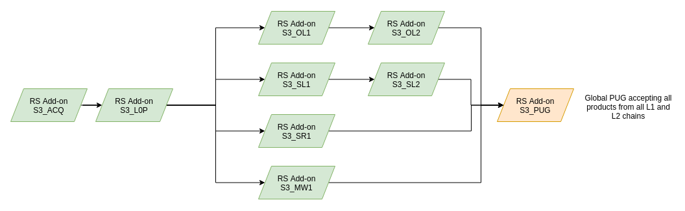

:arrow_heading_up: Go back to the [Reference System Software repository](https://github.com/COPRS/reference-system-software) :arrow_heading_up:

# Processing Sentinel-3
* [Processing Sentinel 3](#processing-sentinel-3)  
  * [Overview](#overview)
  * [Available RS Addons](#available-rs-addons)
  * [Dependencies](#dependencies)
  * [Deployment](#deployment)
  * [Acroynms](#acroynms)

## Overview

Within this repository you can find the RS Add-ons the for the Sentinel-3 mission. Each RS-Add-on contains a mission specific workflow that can be deployed on its own and adding the processing preparation as well as the scientific processor that processes the satellite data.

The following figure provides an overview about how the different RS Add-ons are chained into each other when all are deployed:



The S3 ACQ wrapper contains the IPFs DDC, L0Pre and L0Post processor as a single step and will process EDRS Sessions into S3 granules. These granules are processed by the L0P processor into S3 L0 products.

 ## Available RS Addons
 
The following individual processing chains are available:
* [S3 ACQ](./s3-acq/doc/ReleaseNote.md)
* [S3 L0P](./s3-l0p/doc/ReleaseNote.md)
* [S3 OL1](./s3-ol1/doc/ReleaseNote.md)
* [S3 OL2](./s3-ol2/doc/ReleaseNote.md)
* [S3 MW1](./s3-mw1/doc/ReleaseNote.md)
* [S3 SL1](./s3-sl1/doc/ReleaseNote.md)
* [S3 SL2](./s3-sl2/doc/ReleaseNote.md)
* [S3 SR1](./s3-sr1/doc/ReleaseNote.md)
* [S3 SM HY](./s3-sm2-hy/doc/ReleaseNote.md)
* [S3 SM LI](./s3-sm2-li/doc/ReleaseNote.md)
* [S3 SM SI](./s3-sm2-si/doc/ReleaseNote.md)
* [S3 PUG](./s3-pug/doc/ReleaseNote.md)

For more information, please consult [https://sentinels.copernicus.eu/web/sentinel/missions/sentinel-3](https://sentinels.copernicus.eu/web/sentinel/missions/sentinel-3)


## Dependencies

In order to work properly the RS Add-ons are requiring a few dependencies that needs to be deployed before hands.

**Infrastructure Layer**

COPRS are using a set of technologies that are utilized by the components. E.g. Kafka, Elasticsearch and MongoDB needs to be available. This infrastructure layer needs to be installed first. For more information on its installation, please consult this [repository](https://github.com/COPRS/infrastructure).

**RS Core Components**
The chain itself will not work without other RS Core components. At least the a Ingestion Chain (for retrieving inputs) and Metadata Extraction (for extracting metadata) needs to be deployed to the cluster. It is also highly recommended to deploy the DLQ as well for a proper error handling.

You can find more information and installation instructions in this [repository](https://github.com/COPRS/production-common).

## Deployment

Each RS Add-on contains a description about the services for the specific processing chain that shall be deployed into the cluster as well as a reference to the docker images that shall be used and a factory default configuration.

In order to deploy a RS Add-on the Ansible scripts from the [infrastructure repository](https://github.com/COPRS/infrastructure) can be used. The following Add-Ons are available for deployment:

```
ansible-playbook deploy-rs-addon.yaml \
    -i inventory/mycluster/hosts.ini \
    -e rs_addon_location=rs_addon_location=https://artifactory.coprs.esa-copernicus.eu/artifactory/rs-zip-private/rs-addons/s3/RS_ADDON_S3-ACQ_<VERSION>.zip \
    -e stream_name=S3_ACQ
```

```
ansible-playbook deploy-rs-addon.yaml \
    -i inventory/mycluster/hosts.ini \
    -e rs_addon_location=https://artifactory.coprs.esa-copernicus.eu/artifactory/rs-zip-private/rs-addons/s3/RS_ADDON_S3-L0P_<VERSION>.zip \
    -e stream_name=S3_L0P
```

```
ansible-playbook deploy-rs-addon.yaml \
    -i inventory/mycluster/hosts.ini \
    -e rs_addon_location=https://artifactory.coprs.esa-copernicus.eu/artifactory/rs-zip-private/rs-addons/s3/RS_ADDON_S3-OL1_<VERSION>.zip \
    -e stream_name=S3_OL1
```

```
ansible-playbook deploy-rs-addon.yaml \
    -i inventory/mycluster/hosts.ini \
    -e rs_addon_location=https://artifactory.coprs.esa-copernicus.eu/artifactory/rs-zip-private/rs-addons/s3/RS_ADDON_S3-OL1_<VERSION>.zip \
    -e stream_name=S3_OL2
```

```
ansible-playbook deploy-rs-addon.yaml \
    -i inventory/mycluster/hosts.ini \
    -e rs_addon_location=https://artifactory.coprs.esa-copernicus.eu/artifactory/rs-zip-private/rs-addons/s3/RS_ADDON_S3-MW1_<VERSION>.zip \
    -e stream_name=S3_MW1
```

```
ansible-playbook deploy-rs-addon.yaml \
    -i inventory/mycluster/hosts.ini \
    -e rs_addon_location=https://artifactory.coprs.esa-copernicus.eu/artifactory/rs-zip-private/rs-addons/s3/RS_ADDON_S3-SL1_<VERSION>.zip \
    -e stream_name=S3_SL1
```

```
ansible-playbook deploy-rs-addon.yaml \
    -i inventory/mycluster/hosts.ini \
    -e rs_addon_location=https://artifactory.coprs.esa-copernicus.eu/artifactory/rs-zip-private/rs-addons/s3/RS_ADDON_S3-SL2_<VERSION>.zip \
    -e stream_name=S3_SL2
```

```
ansible-playbook deploy-rs-addon.yaml \
    -i inventory/mycluster/hosts.ini \
    -e rs_addon_location=https://artifactory.coprs.esa-copernicus.eu/artifactory/rs-zip-private/rs-addons/s3/RS_ADDON_S3-SR1_<VERSION>.zip \
    -e stream_name=S3_SR1
```

```
ansible-playbook deploy-rs-addon.yaml \
    -i inventory/mycluster/hosts.ini \
    -e rs_addon_location=https://artifactory.coprs.esa-copernicus.eu/artifactory/rs-zip-private/rs-addons/s3/RS_ADDON_S3-PUG_<VERSION>.zip \
    -e stream_name=S3_PUG
```

For further information on using the deployment script, please consult its [manual](https://github.com/COPRS/infrastructure/blob/e642b4e78782b3e5d649570e4a72b27cb42efeed/doc/how-to/RS%20Add-on%20-%20RS%20Core.md).


## Acroynms

| Abbreviation | Definition |
|---|---|
| COPRS | Copernicus Reference System |
| CPU | Central Processing Unit
| DB | Database |
| DDC | Direct Data Capture |
| EDRS | European Data Relay Satellite |
| IPF | Instrument Processing Facility |
| L0 | Level-0 |
| L1 | Level-1 |
| L2| Level-2|
| RAM | Random Access Memory |
| RS | Reference System |
| S3 | Sentinel-3 |
| SCDF | Spring Cloud Dataflow |
| SpEL | Sprint Expression Language |
| OBS | Object Storage |

