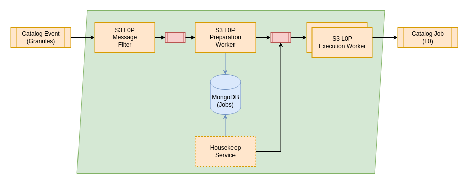

# RS Add-on - S3 L0P

This add-on contains the configuration for the S3 L0p workflow. It is processing the output from the S3 Acquisition workflow and processing the Data in L0 products.

## General

The chain will start from the topic catalog event and watching out for new services there. The message filter will ensure that just EDRS sessions and related auxiliary files are consumed by the chain. All other product types will be discard and no processing occurs. Just if the request is not filtered it will be send to the Preparation worker. Its major task is to ensure that all required products for a production are available. According to the task table of the AIOP it will check if all required auxiliary files can be found in the catalog via the Metadata Search Controller. Additionally it will verify that all required chunks of the session are ingested into the catalog already as well.

If the production is not ready yet the request will be persisted and discarded. Once a new relevant product for the chain arrives, it will check again if all required input products are available. When all suitable products are available the job order will be generated and send to the execution worker. Note that after the Preparation Worker there are three chains available that are gated by a priority filter that allows to split the request regarding their priority on different groups of execution workers. This can be used to priorize certain types of request.

The execution chains does handle three different priorities:

* High
* Medium
* Low

These can be used to honour the different requirements on timeliness. Each priority will have a filter that can be configured to determine the priority of the incoming event and decide which priority will be responsible for performing the processing. It is possible to scale the different worker priorities individually as it might be required to spawn more workers for the high priorities than for the lower ones.

For details, please see [Processing Chain Design](https://github.com/COPRS/reference-system-documentation/blob/develop/components/production%20common/Architecture%20Design%20Document/004%20-%20Software%20Component%20Design.md#processing)

## Requirements

This software does have the following minimal requirements:

| Resource                    | Execution Worker* |
|-----------------------------|-------------|
| CPU                         | 7000m       |
| Memory                      | 50Gi        |
| Disk volume needed          | yes         |
| Disk access                 | ReadWriteOnce |
| Disk storage capacity       | 220Gi **    |
| Affinity between Pod / Node | N/A         |
|                             |             |

*These resource requirements are applicable for one worker. There may be many instances of workers, see scaling up workers for more details.
** This amount had been used in previous operational S1 environment. The disk size might be lower depending on the products that are processed. This needs to be at least twice of the product size of the biggest product. An additional margin of 10% is recommended however.

## Additional Resources 

The preparation worker needs the task table for the IPF wrapped inside of the execution worker. To provide the preparation worker with the needed task table, a configmap will be created by the deployment script based on the file ``tasktable_configmap.yaml``. The resulting configmap contains the task table needed for the S3 L0 preparation worker, in order to create compatible job orders. 

The config map will be created in kubernetes in the processing namespace and will be named ``s3-l0p-tasktables``, to be distinguishable from other tasktable configmaps.

Additionally the S3 L0P chain needs a second configmap ``joborderxslt_configmap.yaml``. This configmap contains an xslt-file to convert the produced JobOrder to be compatible with the Sentinel-3 IPF.

This config map will be created in kubernetes in the processing namespace and will be named ``s3-l0p-joborderxslt``, to be distinguishable from other tasktable configmaps.

# Deployment Prerequisite

Following components of the COPRS shall be installed and running
- [COPRS Infrastructure](https://github.com/COPRS/infrastructure)
OBS Buckets, Kubernetes Secrets and ES indices shall be created.
- See [COPRS OBS Bucket](/processing-common/doc/buckets.md)
- See [COPRS Kubernetes Secret](/processing-common/doc/secrets.md)
- See [COPRS Search Controller)(/rs-processing-common)

The RS Addons are also having the component Preparation worker that is persisting existing jobs that are not ready to run (e.g. missing inputs). In order to work correctly it will require MongoDB as persistence layer. For further general information regarding the creation of a secret for the  MongoDB instance, please see [COPRS MongoDB](/processing-common/doc/secrets.md)

The default configuration provided in the RS Core Component is expecting a secret "mongopreparation" in the namespace "processing" containing a field for PASSWORD and USERNAME that can be used in order to authenticate at the MongoDB.

Please note that further initialization might be required. For the Preparation worker component please execute the following commands in the MongoDB in order to create the credentials for the secret:
``
db.createUser({user: "<USER>", pwd: "<PASSWORD>", roles: [{ role: "readWrite", db: "coprs" }]})
db.sequence.insert({_id: "appDataJob",seq: 0});

## Processing Filter

The processing chain is using two different types of filters:

* A filter used as a gate to decide what products shall be processed (``message-filter``)
* Multiple filters that decides upon the priority of the event (``priority-filter-<high|medium|low>``)

| Property                   				                               | Details       |
|---------------------------------------------------------------|---------------|
|``app.message-filter.filter.function.expression``| A [SpEL](https://docs.spring.io/spring-framework/docs/3.2.x/spring-framework-reference/html/expressions.html) expression that will be performed on the event to decide if the event is applicable for a compression. E.g. for Sentinel-1 the filter configuration using productFamily and keyObjectStorage name of the product could be like: ``(payload.productFamily == 'S3_GRANULES') || ((payload.productFamily == 'S3_AUX') && (payload.keyObjectStorage matches '^S3\\w{2}AX___(BB2|FPO|FRO|OSF).*')) || ((payload.productFamily == 'S3_L0') && (payload.keyObjectStorage matches '^S3\\w{2}TM_0_NAT___.*'))``| 
|``app.priority-filter-high.filter.function.expression``| A [SpEL](https://docs.spring.io/spring-framework/docs/3.2.x/spring-framework-reference/html/expressions.html) expression defining what request are supposed to be handled by the high priority chain. E.g. handling all S1 events with FAST24 timeliness: ``payload.preparationJob.keyObjectStorage matches '^S3\\w{2}TM_0_NAT_.*'``| 
|``app.priority-filter-medium.filter.function.expression``| A [SpEL](https://docs.spring.io/spring-framework/docs/3.2.x/spring-framework-reference/html/expressions.html) expression defining what request are supposed to be handled by the medium priority chain. E.g. handling all S1 events with NRT timeliness. ``!(payload.preparationJob.keyObjectStorage matches '^S3\\w{2}TM_0_NAT_.*') && payload.timeliness == 'NRT'``| 
|``app.priority-filter-low.filter.function.expression``|  [SpEL](https://docs.spring.io/spring-framework/docs/3.2.x/spring-framework-reference/html/expressions.html) expression defining what request are supposed to be handled by the low priority chain. E.g. handling all events that are not having a timeliness: ``!(payload.preparationJob.keyObjectStorage matches '^S3\\w{2}TM_0_NAT_.*') && (payload.timeliness != 'NRT')``| 

## Preparation Worker

The preparation worker is used in all Sentinel-1 and Sentinel-3 RS addon processing chains. The configuration is compounded by two different parts: One generic configuration part, where the properties are common between all processing chains, and one type specific part, which is responsible to control the chain specific logic. 

### Generic configuration part

#### MongoDB Connection

| Property | Details |
|----------|---------|
| ``app.preparation-worker.mongodb.host`` | Hostname to connect to the MongoDB (default: ``mongodb-0.mongodb-headless.database.svc.cluster.local``) |
| ``app.preparation-worker.mongodb.port`` | Port to connect to the MongoDB (default: ``27017``) |
| ``app.preparation-worker.mongodb.database`` | Name of the database to use inside of MongoDB (default: ``coprs``) |
| ``app.preparation-worker.mongodb.username`` | Username to query and update documents in the MongoDB (default: ``${MONGO_USERNAME}``, Environment variable extracted from the secret ``mongoprepration``) |
| ``app.preparation-worker.mongodb.password`` | Password for the user to query and update documents in the MongoDB (default: ``${MONGO_PASSWORD}``, Environment variable extracted from the secret ``mongoprepration``) |

#### Metadata Search Controller Connection

| Property | Details |
|----------|---------|
| ``app.preparation-worker.metadata.metadataHostname`` | Hostname and port to connect to the search controller (default: ``rs-metadata-catalog-searchcontroller-svc:8080``) |
| ``app.preparation-worker.metadata.nbretry`` | Number of retries, when a query fails (default: ``3``) |
| ``app.preparation-worker.metadata.temporetryms`` | Timeout between retries in milliseconds (default: ``1000``) |

#### Process Configuration 

| Property | Details |
|----------|---------|
| ``app.preparation-worker.process.level`` | Process level for the preparation worker. Controls level specific logic. For S3 L0P: ``S3_L0`` |
| ``app.preparation-worker.process.mode`` | Process mode for the preparation worker. Allowed values: ``PROD``, ``TEST`` (default: ``PROD``) |
| ``app.preparation-worker.process.hostname`` | Hostname of the preparation worker (default: ``${HOSTNAME}``) |
| ``app.preparation-worker.process.productType`` | ProductType of main inputs. Used for logging/reporting (default: ``S3_L0_Granule``) |
| ``app.preparation-worker.process.loglevelstdout`` | LogLevel for stdout of the IPF process wrapped in the execution worker (default: ``INFO``) |
| ``app.preparation-worker.process.loglevelstderr`` | LogLevel for stderr of the IPF process wrapped in the execution worker (default: ``INFO``) |
| ``app.preparation-worker.process.processingstation`` | Processing Station (default: ``S3__``) |
| ``app.preparation-worker.process.params`` | Dynamic processing parameters for the job order. Contains a map of key value pairs |
| ``app.preparation-worker.process.outputregexps`` | Map to match regular expressions to output file types. Key: output file type, Value: regular expression used for file names |

#### Worker Configuration

| Property | Details |
|----------|---------|
| ``app.preparation-worker.worker.diroftasktables`` | Directory, where the tasktables can be found (default: ``/app/tasktables``) |
| ``app.preparation-worker.worker.maxnboftasktable`` | Number of task tables. For S3 L0P: ``24`` |
| ``app.preparation-worker.worker.defaultfamily`` | Default ProductFamily for product types not found in inputfamilies or outputfamilies (default: ``BLANK``) |
| ``app.preparation-worker.worker.inputfamiliesstr`` | Key-Value pairs of mappings of product types to ProductFamily for input product types |
| ``app.preparation-worker.worker.outputfamiliesstr`` | Key-Value pairs of mappings of product types to ProductFamily for output product types |
| ``app.preparation-worker.worker.type-overlap`` | Map of all overlap for different slice types in Sentinel-1 |
| ``app.preparation-worker.worker.type-slice-length`` | Map of all lengths for different slice types in Sentinel-1 |
| ``app.preparation-worker.worker.map-type-meta`` | Map for product types to corresponding metadata indexes, if the product type itself is not the same as the index |

#### Tasktable Configuration

| Property | Details |
|----------|---------|
| ``app.preparation-worker.tasktable.routingKeyTemplate`` | Template how to match incoming messages onto the routing mapping configured in ``routing``. For S3 L0P: ``$(product.productType)_$(product.satelliteId)`` |
| ``app.preparation-worker.tasktable.routing`` | Map to determine tasktable to use for an incoming message, to create new AppDataJobs for the preparation worker |

### Product type specific configuration part

| Property | Details |
|----------|---------|
| ``app.preparation-worker.s3-type-adapter.mpc-search.<product_type>.product-types`` | List of Product Types to apply the MultipleProductCoverSearch Extension for Sentinel-3 on |
| ``app.preparation-worker.s3-type-adapter.mpc-search.<product_type>.gap-threshold`` | Threshhold in seconds, defining when a gap is big enough to be recognized as a gap and therefor signaling, that the currently found products are not enough to cover the interval |
| ``app.preparation-worker.s3-type-adapter.dyn-proc-params`` | Map of static key value pairs, that should be added to JobOrder |
| ``app.preparation-worker.s3-type-adapter.optional-outputs.<product_type>`` | List of optional outputs of tasktable, that shall be produced. |

## Execution Worker

For each priority chain a separate configuration needs to be created. The configuration is however identically and applicable for:

* app.execution-worker-high
* app.execution-worker-medium
* app.execution-worker-low

The following description is just given for high priority workers:

### Important SCDF Properties

| Property | Details |
|----------|---------|
| ``app.execution-worker-high.spring.cloud.stream.kafka.bindings.input.consumer.configuration.max.poll.records`` | Number of records that are pulled in batch when retrieving new messages for the kafka consumer. Tests have shown, that for reliable processing this property shall be set to ``1`` |
| ``app.execution-worker-high.spring.cloud.stream.kafka.bindings.input.consumer.configuration.max.poll.interval.ms`` | Number of milliseconds how long the processing of one kafka message shall take, before consumer is kicked from consumer group by the kafka broker. This property is very important for the processing of long-running tasks. |

### Process Configuration

| Property | Details |
|----------|---------|
| ``app.execution-worker-high.process.level`` | Process level for the execution worker. Controls level specific logic. For S3 L0P: ``S3_L0`` |
| ``app.execution-worker-high.process.hostname`` | Hostname of the execution worker (default: ``${HOSTNAME}``) |
| ``app.execution-worker-high.process.workingDir`` | Working directory for the execution worker. Location where the currently processed AppDataJob will be saved (default: ``/data/localWD``) |
| ``app.execution-worker-high.process.tm-proc-stop-s`` | Seconds how long the cleaning of a JobProcessing may take in seconds (default: ``300``) |
| ``app.execution-worker-high.process.tm-proc-one-task-s`` | Seconds how long one task is allowed to run for in seconds (default: ``600``) |
| ``app.execution-worker-high.process.tm-proc-all-tasks-s`` | Seconds how long all tasks at sum are allowed to run for in seconds (default: ``7200``) |
| ``app.execution-worker-high.process.size-batch-upload`` | Number of outputs, that should be uploaded in parallel (default: ``2``) |
| ``app.execution-worker-high.process.size-batch-download`` | Number of inputs, that should be downloaded in parallel (default: ``10``) |
| ``app.execution-worker-high.process.wap-nb-max-loop`` | Number of retries when checking if process is active (default: ``12``) |
| ``app.execution-worker-high.process.wap-tempo-s`` | Seconds how long to wait between each check if process is active (default: ``10``) |
| ``app.execution-worker-high.process.threshold-ew`` | Threshold for length to determine if a file is a ghost candidate for polarisation EW (default: ``3``) |
| ``app.execution-worker-high.process.threshold-iw`` | Threshold for length to determine if a file is a ghost candidate for polarisation IW (default: ``3``) |
| ``app.execution-worker-high.process.threshold-sm`` | Threshold for length to determine if a file is a ghost candidate for polarisation SM (default: ``3``) |
| ``app.execution-worker-high.process.threshold-wv`` | Threshold for length to determine if a file is a ghost candidate for polarisation WV (default: ``30``) |
| ``app.execution-worker-high.process.path-job-order-xslt`` | Path to the job order xslt, that will be applied on the given joborder before sending it to the IPF |

### Development Configuration

| Property | Details |
|----------|---------|
| ``app.execution-worker-high.dev.stepsActivation.download`` | Switch to determine whether or not inputs shall be downloaded (default: ``true``) |
| ``app.execution-worker-high.dev.stepsActivation.upload`` | Switch to determine whether or not outputs shall be uploaded (default: ``true``) |
| ``app.execution-worker-high.dev.stepsActivation.erasing`` | Switch to determine whether or not the working directory shall be deleted (default: ``true``) |

## Deployer properties

The following table only contains a few properties used by the factory default configuration. For more information please refer to the [official documentation](https://docs.spring.io/spring-cloud-dataflow/docs/current/reference/htmlsingle/#configuration-kubernetes-deployer) or COPRS-ICD-ADST-001139201 - ICD RS core.
  
| Property | Details |
|-|-|
| `deployer.<application-name>.kubernetes.namespace` | Namespace to use | 
| `deployer.<application-name>.kubernetes.livenessProbeDelay` | Delay in seconds when the Kubernetes liveness check of the app container should start checking its health status. | 
| `deployer.<application-name>.kubernetes.livenessProbePeriod` | Period in seconds for performing the Kubernetes liveness check of the app container. | 
| `deployer.<application-name>.kubernetes.livenessProbeTimeout` | Timeout in seconds for the Kubernetes liveness check of the app container. If the health check takes longer than this value to return it is assumed as 'unavailable'. | 
| `deployer.<application-name>.kubernetes.livenessProbePath` | Path that app container has to respond to for liveness check. | 
| `deployer.<application-name>.kubernetes.livenessProbePort` | Port that app container has to respond on for liveness check. | 
| `deployer.<application-name>.kubernetes.readinessProbeDelay` | Delay in seconds when the readiness check of the app container should start checking if the module is fully up and running. | 
| `deployer.<application-name>.kubernetes.readinessProbePeriod` | Period in seconds to perform the readiness check of the app container. | 
| `deployer.<application-name>.kubernetes.readinessProbeTimeout` | Timeout in seconds that the app container has to respond to its health status during the readiness check. | 
| `deployer.<application-name>.kubernetes.readinessProbePath` | Path that app container has to respond to for readiness check. | 
| `deployer.<application-name>.kubernetes.readinessProbePort` | Port that app container has to respond on for readiness check. | 
| `deployer.<application-name>.kubernetes.limits.memory` | The memory limit, maximum needed value to allocate a pod, Default unit is mebibytes, 'M' and 'G" suffixes supported | 
| `deployer.<application-name>.kubernetes.limits.cpu` | The CPU limit, maximum needed value to allocate a pod | 
| `deployer.<application-name>.kubernetes.requests.memory` | The memory request, guaranteed needed value to allocate a pod. | 
| `deployer.<application-name>.kubernetes.requests.cpu` | The CPU request, guaranteed needed value to allocate a pod. | 
| `deployer.<application-name>.kubernetes.maxTerminatedErrorRestarts` | Maximum allowed restarts for app that fails due to an error or excessive resource use. | 
| `deployer.<application-name>.kubernetes.environmentVariables` | Can be used to pass additional environmental variables into the application.  This can be used for example to set JVM specific arguments to use 512m. The example given shows how the XMX argument can be set: JAVA_TOOL_OPTIONS=-Xmx512m   For further information, please consult [this](https://docs.spring.io/spring-cloud-dataflow/docs/current/reference/htmlsingle/#_environment_variables) page. |
| `deployer.<application-name>.kubernetes.podSecurityContext` | Can be used to change which user shall be used to execute commands inside of the SCDF application | `deployer.<application-name>.kubernetes.secretKeyRefs` | Mappings to retrieve values from kubernetes secrets and provide them in the container as environment variables |
| `deployer.<application-name>.kubernetes.volumeMounts` | List of volume mounts. Contains information of the name of volume and where inside the container the volume shall be mounted |
| `deployer.<application-name>.kubernetes.volumes` | List of volumes. Contains information regarding the type and name of the volume |

Please note that it will be required to setup certain deployer properties like imagePullSecrets or hardware requirement for the different workers individually. The configuration items are the same as described above however.
