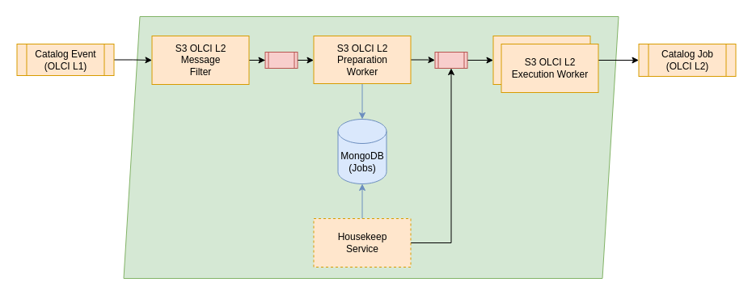

# RS Add-on - S3 L0P

This add-on contains the configuration for the processing chain of the Sentinel-3 OL2 Processor. It is processing the outputs from the S3 OL1 workflow into S3 L2 products.

## General

