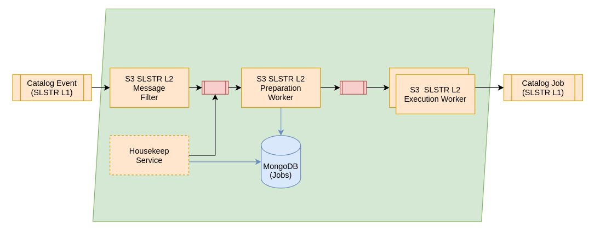

:arrow_heading_up: Go back to the [Reference System Software repository](https://github.com/COPRS/reference-system-software) :arrow_heading_up:

# RS Add-on - S3 L2 SL2

 
 * [RS Add-on S3 L2 SL2](#rs-add-on---s3-l2-sl2)
    * [Overview](#overview)
    * [Requirements](#requirements)
    * [Additional Resources](#additional-resources)
    * [Deployment Prerequisite](#deployment-prerequisite)

This add-on contains the configuration for the processing chain of the Sentinel-3 SL2 Processor. It is processing the outputs from the S3 L1 workflow into S3 L2 products.

## Overview

The chain will start from the topic catalog event and watching out for new products there. The message filter will ensure that just suitable products for this chain and related auxiliary files are consumed by the chain. All other product types will be discard and no processing occurs. 

If the production is not ready yet the request will be persisted and discarded. Once a new relevant product for the chain arrives, it will check again if all required input products are available.

Please note that the S3 RS Add-ons are not having priority filter. The different timeliness are handled by RS Add-ons on its own as configuration and workflows can be different for the timeliness. Thus no priority filter is used. Thus one the preparation worker created a job, the execution worker will consume it and executing the processing. In order to increase the amount of products that can be processed in parallel, please scale up the execution workers to have a higher overall throughtput.

For details, please see [Processing Chain Design](https://github.com/COPRS/production-common/blob/develop/docs/architecture/README.md#processing)

## Requirements

This software does have the following minimal requirements:

| Resource                    | Execution Worker* |
|-----------------------------|-------------|
| CPU                         | 7000m       |
| Memory                      | 50Gi        |
| Disk volume needed          | yes         |
| Disk access                 | ReadWriteOnce |
| Disk storage capacity       | 220Gi **    |
| Affinity between Pod / Node | N/A         |
|                             |             |

*These resource requirements are applicable for one worker. There may be many instances of workers, see scaling up workers for more details.
** This amount had been used in previous operational environment. The disk size might be lower depending on the products that are processed. This needs to be at least twice of the product size of the biggest product. An additional margin of 10% is recommended however.

## Additional Resources 

The preparation worker needs the task table for the IPF wrapped inside of the execution worker. To provide the preparation worker with the needed task table, a configmap will be created by the deployment script based on the file ``tasktable_configmap.yaml``. The resulting configmap contains the task table needed for the preparation worker, in order to create compatible job orders. 

The config map will be created in kubernetes in the processing namespace and will be named ``s3-sl2-tasktables``, to be distinguishable from other tasktable configmaps.

Additionally the chain needs a second configmap ``joborderxslt_configmap.yaml``. This configmap contains an xslt-file to convert the produced JobOrder to be compatible with the Sentinel-3 IPF.

This config map will be created in kubernetes in the processing namespace and will be named ``s3-sl2-joborderxslt``, to be distinguishable from other tasktable configmaps.

## Deployment Prerequisite

In order to operate this RS add-on there are some dependencies that needs to be deployed beforehand. For additional information, please consult the [common configuration](/common/README.md#deployment-prerequisite).

## Configuration

The RS add-on is using a set of generic microservices from the RS Core. The configuration of these configuration parameters are not given within this document, but can be found in the [common documentation](/common/README.md) that is applicable for all RS add-ons.

There are no specific configurations existing for this RS add-on.

