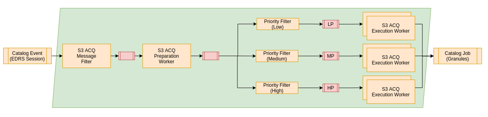

# RS Add-on - S3 Acquisition

This add-on contains the configuration for the S3 Acquisition workflow. In the legacy system for this workflow the IPF DDC, L0Pre, L0Post had been performed. As the DDC is however a daemonized system, it is not really compatible with the COPRS styled addons.

Thus a wrapper was created to provide a ESA Generic ICD compatible interface for all processors. Thus when a S3 EDRS Session is processed by the system the wrapper will be invoked and processing the data with all three processors.

## General

The chain will start for the topic catalog event and watching out for new services there. The message filter will ensure that just EDRS sessions and related auxiliary files are consumed by the chain. All other product types will be discard and no processing occurs. Just if the request is not filtered it will be send to the Preparation worker. Its major task is to ensure that all required products for a production are available. According to the task table of the AIOP it will check if all required auxiliary files can be found in the catalog via the Metadata Search Controller. Additionally it will verify that all required chunks of the session are ingested into the catalog already as well.

If the production is not ready yet the request will be persisted and discarded. Once a new relevant product for the chain arrives, it will check again if all required input products are available. When all suitable products are available the job order will be generated and send to the execution worker. Note that after the Preparation Worker there are three chains available that are gated by a priority filter that allows to split the request regarding their priority on different groups of execution workers. This can be used to priorize certain types of request.

The execution chains does handle three different priorities:

* High
* Medium
* Low

These can be used to honour the different requirements on timeliness. Each priority will have a filter that can be configured to determine the priority of the incoming event and decide which priority will be responsible for performing the processing. It is possible to scale the different worker priorities individually as it might be required to spawn more workers for the high priorities than for the lower ones.

For details, please see [Processing Chain Design](https://github.com/COPRS/reference-system-documentation/blob/develop/components/production%20common/Architecture%20Design%20Document/004%20-%20Software%20Component%20Design.md#processing)

## Requirements

This software does have the following minimal requirements:

| Resource                    | Execution Worker* |
|-----------------------------|-------------|
| CPU                         | 7000m       |
| Memory                      | 50Gi        |
| Disk volume needed          | yes         |
| Disk access                 | ReadWriteOnce |
| Disk storage capacity       | 220Gi **    |
| Affinity between Pod / Node | N/A         |
|                             |             |

*These resource requirements are applicable for one worker. There may be many instances of workers, see scaling up workers for more details.
** This amount had been used in previous operational S1 environment. The disk size might be lower depending on the products that are processed. This needs to be at least twice of the product size of the biggest product. An additional margin of 10% is recommended however.

## Processing Filter

The processing chain is using two different types of filters:

* A filter used as a gate to decide what products shall be processed (``message-filter``)
* Multiple filters that decides upon the priority of the event (``priority-filter-<high|medium|low>``)

| Property                   				                               | Details       |
|---------------------------------------------------------------|---------------|
|``app.message-filter.filter.function.expression``| A [SpEL](https://docs.spring.io/spring-framework/docs/3.2.x/spring-framework-reference/html/expressions.html) expression that will be performed on the event to decide if the event is applicable for a compression. E.g. for Sentinel-1 the filter configuration using productFamily and keyObjectStorage name of the product could be like: ``((payload.productFamily matches '^((S\\d.*)|(AUX.*)|(L\\d.*))(?<!(ZIP|AUX|JOB|GRANULES|REPORT|ETAD|SAD|BLANK)$)$') && (!(payload.productFamily == AUXILIARY_FILE) || !(payload.keyObjectStorage matches 'S1__OPER_MSK_EW_SLC_.*\\.EOF')) && (!(payload.productFamily == L0_SEGMENT) || ((payload.keyObjectStorage matches 'S1._(GP|HK|RF).*_RAW.*\.SAFE)') && !(product.keyObjectStorage matches 'S1._RF_RAW__0.(HH|HV|VV|VH)_.*\.SAFE'))))``| 
|``app.priority-filter-high.filter.function.expression``| A [SpEL](https://docs.spring.io/spring-framework/docs/3.2.x/spring-framework-reference/html/expressions.html) expression defining what request are supposed to be handled by the high priority chain. E.g. handling all S1 events with FAST24 timeliness: ``payload.timeliness == 'FAST24'``| 
|``app.priority-filter-medium.filter.function.expression``| A [SpEL](https://docs.spring.io/spring-framework/docs/3.2.x/spring-framework-reference/html/expressions.html) expression defining what request are supposed to be handled by the medium priority chain. E.g. handling all S1 events with NRT timeliness. ``payload.timeliness == 'NRT'``| 
|``app.priority-filter-low.filter.function.expression``|  [SpEL](https://docs.spring.io/spring-framework/docs/3.2.x/spring-framework-reference/html/expressions.html) expression defining what request are supposed to be handled by the low priority chain. E.g. handling all events that are not having a timeliness: ``payload.timeliness == null``| 

## Preparation Worker

**TBD**

## Execution Worker

For each priority chain a separate configuration needs to be created. The configuration is however identically and applicable for:

* app.execution-worker-high
* app.execution-worker-medium
* app.execution-worker-low

The following description is just given for high priority workers:

**TBD**

| Property                   				                               | Details       |
|---------------------------------------------------------------|---------------|

## Deployer properties

**TBD**

The following table only contains a few properties used by the factory default configuration. For more information please refer to the [official documentation](https://docs.spring.io/spring-cloud-dataflow/docs/current/reference/htmlsingle/#configuration-kubernetes-deployer) or COPRS-ICD-ADST-001139201 - ICD RS core.
  
| Property | Details |
|-|-|
| `deployer.<application-name>.kubernetes.namespace` | Namespace to use | 
| `deployer.<application-name>.kubernetes.livenessProbeDelay` | Delay in seconds when the Kubernetes liveness check of the app container should start checking its health status. | 
| `deployer.<application-name>.kubernetes.livenessProbePeriod` | Period in seconds for performing the Kubernetes liveness check of the app container. | 
| `deployer.<application-name>.kubernetes.livenessProbeTimeout` | Timeout in seconds for the Kubernetes liveness check of the app container. If the health check takes longer than this value to return it is assumed as 'unavailable'. | 
| `deployer.<application-name>.kubernetes.livenessProbePath` | Path that app container has to respond to for liveness check. | 
| `deployer.<application-name>.kubernetes.livenessProbePort` | Port that app container has to respond on for liveness check. | 
| `deployer.<application-name>.kubernetes.readinessProbeDelay` | Delay in seconds when the readiness check of the app container should start checking if the module is fully up and running. | 
| `deployer.<application-name>.kubernetes.readinessProbePeriod` | Period in seconds to perform the readiness check of the app container. | 
| `deployer.<application-name>.kubernetes.readinessProbeTimeout` | Timeout in seconds that the app container has to respond to its health status during the readiness check. | 
| `deployer.<application-name>.kubernetes.readinessProbePath` | Path that app container has to respond to for readiness check. | 
| `deployer.<application-name>.kubernetes.readinessProbePort` | Port that app container has to respond on for readiness check. | 
| `deployer.<application-name>.kubernetes.limits.memory` | The memory limit, maximum needed value to allocate a pod, Default unit is mebibytes, 'M' and 'G" suffixes supported | 
| `deployer.<application-name>.kubernetes.limits.cpu` | The CPU limit, maximum needed value to allocate a pod | 
| `deployer.<application-name>.kubernetes.requests.memory` | The memory request, guaranteed needed value to allocate a pod. | 
| `deployer.<application-name>.kubernetes.requests.cpu` | The CPU request, guaranteed needed value to allocate a pod. | 
| `deployer.<application-name>.kubernetes.maxTerminatedErrorRestarts` | Maximum allowed restarts for app that fails due to an error or excessive resource use. | 
| `deployer.<application-name>.kubernetes.environmentVariables` | Can be used to pass additional environmental variables into the application.  This can be used for example to set JVM specific arguments to use 512m. The example given shows how the XMX argument can be set: JAVA_TOOL_OPTIONS=-Xmx512m   For further information, please consult [this](https://docs.spring.io/spring-cloud-dataflow/docs/current/reference/htmlsingle/#_environment_variables) page. |

Please note that it will be required to setup certain deployer properties like imagePullSecrets or hardware requirement for the different workers individually. The configuration items are the same as described above however.
